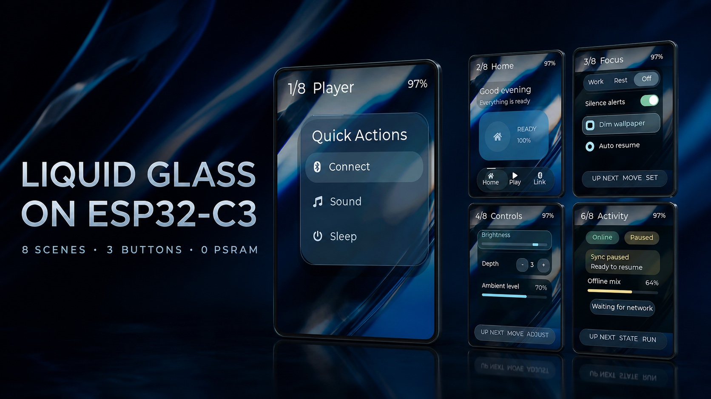
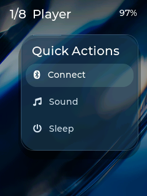
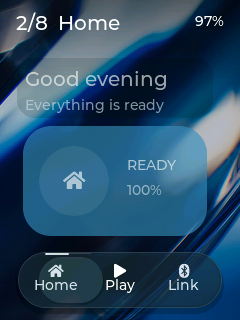
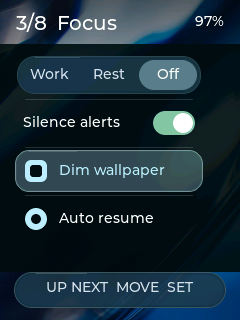
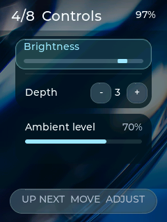
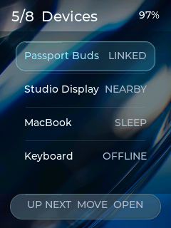
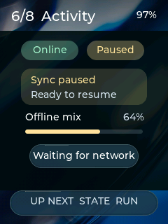
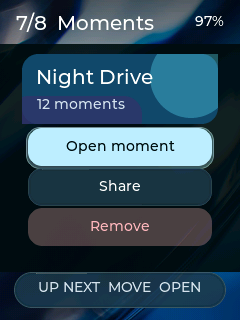
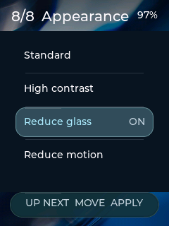

<p align="right">
  <a href="README.md">English</a> · <strong>简体中文</strong>
</p>

# ESP32-C3 上的 Liquid Glass UI

这是一套面向 AI Passport 硬件的八场景交互与动效作品集：240×320 屏幕、三个实体
按键、8 MB Flash，并且没有 PSRAM。



项目探索在单片机资源约束下，如何保留透明材质、焦点移动、窗口形变、状态反馈和
手机式导航的表现力。这是独立的设计与工程实验，与 Apple 无官方关联。

## 八个展示场景

| Player | Home | Focus | Controls |
| --- | --- | --- | --- |
|  |  |  |  |
| Devices | Activity | Moments | Appearance |
|  |  |  |  |

无人演示时，每页停留七秒，页内标志交互每秒推进一次；第一次实体按键输入会立即
停止自动演示并把控制权交给用户。

| 按键 | 操作 |
| --- | --- |
| UP | 下一页 |
| DOWN | 移动焦点或选区 |
| OK | 执行当前焦点动作 |
| 长按 OK | 返回硬件诊断菜单 |

## 主要能力

- 让壁纸细节穿透玻璃，而不是把每个界面做成不透明大卡片。
- 焦点、分段选择器、开关、滑杆、导航和菜单形变均使用确定性非线性动画。
- 使用八个手机式应用场景展示交互，而不是传统单片机仪表盘。
- 提供 Standard、High Contrast、Reduce Glass 和 Reduce Motion 模式。
- 使用面向 RGB565 的低分配合成器和有界脏区规划器。
- 通过 USB Serial/JTAG 低内存回采截图，支持可重复的视觉评审。

## 设计交付物

- [产品定义](PRODUCT.zh_CN.md)
- [系统设计](DESIGN.zh_CN.md)
- [组件清单](design/liquid-glass/components.json)
- [设计 Tokens](design/liquid-glass/tokens.json)
- [设计包说明](design/liquid-glass/README.zh_CN.md)

可复用板级能力位于 `components/bsp`；页面、状态机和动画位于 `main`。Motion、
Optics 与 Compositor 的核心计算不依赖 ESP-IDF/LVGL，并由主机测试覆盖。

## 构建与验证

要求：

- AI Passport / ESP32-C3 硬件
- ESP-IDF 5.5.3

```bash
source /path/to/esp-idf-v5.5.3/export.sh
./tools/validate.sh
```

快速验证：

```bash
./tools/validate.sh --static
./tools/validate.sh --firmware
```

固件保留 AI Passport 模板契约：应用不超过 3 MB、`cardid` 位于 `0x356000`、永久
Recovery 位于 `0x700000`，以及长按 UP 五秒进入 Recovery 的启动钩子。

## 回采屏幕

```bash
python tools/capture_screen.py \
  --port /dev/cu.usbmodem101 \
  --output build/showcase/frame.png \
  --count 8 \
  --interval 7
```

## 致谢与许可

本项目基于开源的 [FoloToy AI Passport](https://github.com/FoloToy/ai-passport)
开发，使用 MIT License，详见 [LICENSE](LICENSE)。
